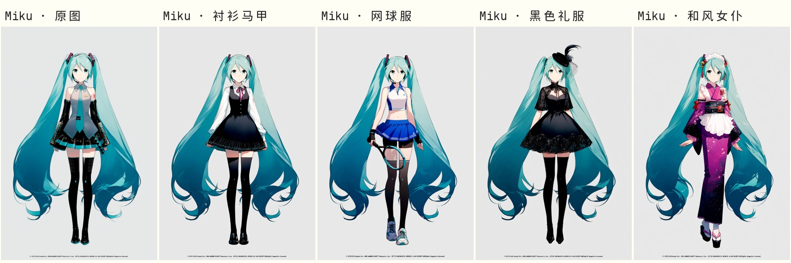
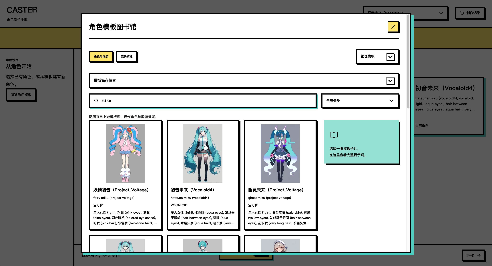
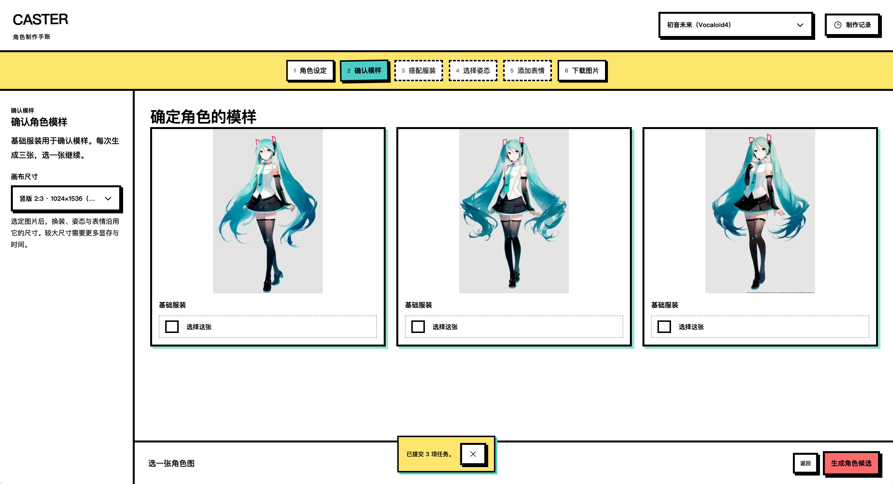
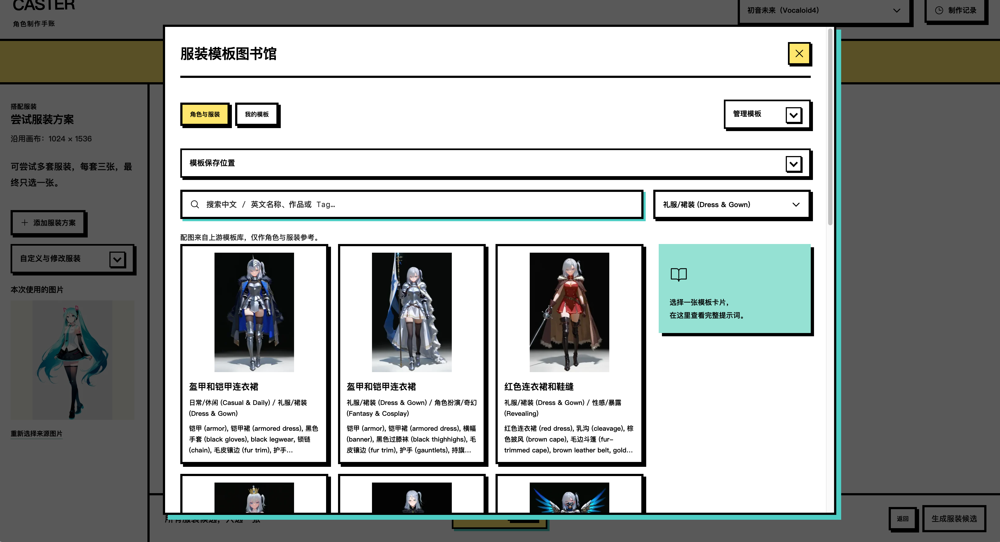

<h1 align="center">CASTER</h1>

<p align="center">Agent 辅助规划、用户确认执行的角色资产制作工作台</p>

<p align="center">Character Asset Synthesis, Transformation &amp; Expression Rendering</p>

<p align="center">
  <a href="#快速开始">快速开始</a> ·
  <a href="#工作流">工作流</a> ·
  <a href="docs/README.md">文档</a> ·
  <a href="CONTRIBUTING.md">开发与贡献</a> ·
  <a href=".agents/skills/caster-character-production/SKILL.md">Agent Skill</a>
</p>

CASTER 将角色原图、换装、动作编辑、表情编辑和透明导出放进一个制作流程。LlamaIndex Agent 检索角色与服装、查询标签知识并准备计划；你在工作台确认变更与生成，再比较候选图、选定后续制作的来源。ComfyUI 执行生成，FastAPI 与 SQLite 保存任务、授权快照和资产来源。

支持两种创作方式：**分步制作**维护可复用的角色资产链，**单张创作**沿用当前角色准备一次性画面。Agent 没有直接批准或提交 GPU 任务的工具。

**运行环境：** Python 3.12、uv、Node.js 22/npm。真实生成已在 Linux + RTX 4090 24GB 上验证，使用低显存模式和 CPU VAE；无 GPU 也能运行前端演示及模板、任务管理 API。完整模型环境见[依赖说明](docs/DEPENDENCIES.md)。

## 功能

| 你想完成的事 | CASTER 提供的能力 |
| --- | --- |
| 用自然语言准备创作 | LlamaIndex 工具调用、流式会话、检索证据、工作台变更卡和生成审批卡 |
| 找到合适的视觉标签 | 本地模板检索，以及可选 Qwen3 Embedding + Qdrant Wiki 检索 |
| 快速建立角色 | 角色与服装模板、参考配图、中文名称和双语标签搜索，支持个人模板 JSON 导入 |
| 比较不同设计 | 身份、服装和动作分别生成候选，选定图片继续制作，保留旧版本 |
| 调整动作与表情 | Pose Studio 三维姿态预设、Qwen 动作编辑、脸部局部表情回贴 |
| 获得可用素材 | 常见画布比例、继承源图尺寸、原图下载和 RGBA 透明 PNG 导出 |
| 跟踪制作进度 | 常驻任务记录、批次进度、排队取消、失败重试及资产来源 |

### 前后端如何配合

- **React + TypeScript + Vite 前端**：提供创作助手、分步制作、模板库、候选比较与任务侧栏。
- **LlamaIndex Agent**：管理模型工具循环和结构化输出；受限工具准备可审阅的变更与计划。
- **FastAPI + SQLite 后端**：编译提示词、管理角色与服装版本、保存任务及资产，通过 API 调用 ComfyUI。
- **ComfyUI 生成环境**：加载模型和节点，执行 AnimaYume、Qwen 与 BiRefNet 工作流。

前端请求通过 `/api` 代理到后端。后端串行提交生成任务，记录 prompt ID，在连接恢复时核对执行结果。

审批、恢复与工具循环已有离线回归测试；真实模型的长会话效果和完整 Agent 生成链仍需人工验收。

## 制作流程与效果

**角色模板 → 身份原图 → 服装设计 → 动作编辑 → 表情编辑 → 透明导出**

### Miku · 四套换装

从同一张新生成的身份图分别制作衬衫马甲、网球服、黑色礼服和和风女仆装。



### 约尔 · 四个动作

先生成角色并换装，再以这张换装图分别制作比耶、弓步格斗、半躺屈膝和单手叉腰。


### 玛奇玛 · 四种表情

从同一张换装基准图分别制作生气、开心、鄙视和惊讶。每格右下角展示相同区域的脸部放大图，便于比较表情细节。


以上为生成的同人样例。三行分别展示换装、动作与表情功能，本组不含透明抠图。

1. **选择角色**：从模板建立角色，或填写自己的名称与外观标签。
2. **确定身份**：选择画布尺寸，生成并选定身份图。
3. **设计服装**：尝试多套服装，从全部候选中选一张进入动作制作。
4. **制作动作**：选择姿态预设，生成并选定动作图。
5. **添加表情**：从选定动作图分别制作开心、生气等表情。
6. **导出资产**：预览原图与透明边缘，下载图片和资产清单。

## 工作台界面预览

下面的截图记录当前桌面工作台已经实现的前三个界面节点，后续步骤会沿用同一套制作语言继续完善。

### 1. 角色模板图书馆

搜索角色、查看配套预览图和双语标签，从模板卡片进入身份设定。



### 2. 身份候选

在选定画布尺寸后比较同一角色的候选图，选择一张作为后续换装和动作的基准。



### 3. 服装模板图书馆

基于已选角色浏览服装模板、分类和提示词，添加服装方案并进入换装候选。



## 快速开始

以下命令在目标开发机器的项目根目录执行。只体验 `?preview=1` 演示时可直接启动前端，无需 Python 或 GPU。

### 1. 启动后端

```bash
uv sync --locked --group dev
# 首次运行创建本地配置；已有配置保持不变
[ -f config.env ] || cp config.env.example config.env
bash scripts/run.sh
```

默认后端地址为 `http://127.0.0.1:8189`。打开 [API 文档](http://127.0.0.1:8189/docs) 可查看接口；访问 [`/health`](http://127.0.0.1:8189/health) 可检查服务状态。

### 2. 启动前端

在另一个终端执行：

```bash
cd frontend
npm ci
npm run dev
```

打开 [本地演示](http://127.0.0.1:4173/?preview=1) 体验制作步骤，或打开 [工作台](http://127.0.0.1:4173/) 连接后端。演示状态保存在浏览器；新克隆没有历史样例图时，图片区域显示占位提示。

### 3. 接入真实生成

按[依赖说明](docs/DEPENDENCIES.md)安装 ComfyUI、节点和模型，将 `config.env` 中的 `AIGC_COMFY_URL` 指向服务地址。准备模板和 Pose Studio 资源后，在工作台中开始制作。模型权重、模板缓存和运行数据库由本地环境管理。

使用创作助手时，在侧栏保存支持工具调用的 OpenAI-compatible 模型连接；密钥只保存于后端数据目录。
语义检索需要另行准备 Qdrant、编码器和版本化索引，配置步骤见 [RAG 维护](docs/RAG.md)。未配置模型时仍可使用手动制作界面。

配置项统一由 [`aigc/config.py`](aigc/config.py) 读取：

| 配置 | 用途 | 默认值 |
| --- | --- | --- |
| `AIGC_API_URL` | 后端监听地址、前端代理目标 | `http://127.0.0.1:8189` |
| `AIGC_COMFY_URL` | ComfyUI 服务地址 | `http://127.0.0.1:8188` |
| `AIGC_UI_URL` | 前端开发服务地址 | `http://127.0.0.1:4173` |
| `AIGC_DATA_DIR` | 数据库、模板、缓存与生成资产 | 项目下的 `data/` |

`config.env` 不进入 Git。显式进程环境变量可覆盖本地配置，工具的命令行参数可覆盖对应默认值。远程服务访问见[运行手册](docs/OPERATIONS.md)。

## 工作流

| 阶段 | 模型与方式 | 默认采样配置 |
| --- | --- | --- |
| [角色原图](workflows/sprite.api.json) | AnimaYume v15 文生图 | Euler / Beta，36 步，CFG 4，Shift 3 |
| [角色换装](workflows/outfit.api.json) | AnimaYume 图生图 | 同上，重绘强度 0.8 |
| [动作编辑](workflows/pose.api.json) | Qwen Image Edit 2511 + Pose Studio LoRA | Lightning 4 步，CFG 1，Euler / simple |
| [表情编辑](workflows/expression.api.json) | Qwen 脸部裁剪编辑 + SAM 掩码回贴 | 不加载姿态 LoRA，保留掩码外像素 |
| [透明抠图](workflows/matte.api.json) | BiRefNet | 保持画布，输出 RGBA |
| [背景生成](workflows/background.api.json) | AnimaYume 文生图 | 使用统一 Anima 配置，独立 API 工作流 |

Anima 的 Beta 调度参数为 α=β=0.6；画师风格、固定正面和固定负面词由运行时设置管理，
不写入服装模板。角色与作品名的括号由编译器处理转义。默认立绘为 1024×1536，其他尺寸见
[画布预设](integrations/canvas-presets.json)。

动作编辑以 Pose Studio 人偶渲染图为 image1、角色图为 image2，使用 Qwen 多图参考编码和 Pose LoRA。表情从同一基准图独立分支，局部编辑保持有效掩码外像素不变。

API 图、ComfyUI 可视图与参数绑定保存在 `workflows/`；可选研究工作流单独放在 `workflows/experimental/`。

## API 与 Agent 使用

后端提供 `/prompt-templates`、`/production/*`、`/jobs` 和 `/assets` 等接口。完整请求字段以运行中的 `/docs` 为准。命令行客户端可直接读取本地配置：

```bash
uv run --locked python scripts/aigc.py request GET /production/capabilities
```

产品内 Agent 接口位于 `/agent`：会话与事件流、检索状态、工作台变更及生成计划分别管理。
只有用户批准计划时才创建相应生成任务；执行前再次核对来源图片、工作流和绑定摘要。

项目提供通用 [角色制作 Skill](.agents/skills/caster-character-production/SKILL.md)，指导 Agent 发现配置、匹配角色与服装模板、串联现有接口并交付资产。支持项目 Skill 发现的工具可读取 `.agents/skills/`，其他 Agent 可直接读取该文件。它复用现有 API，不包含独立生成服务。

自定义角色与服装的 JSON 格式见[模板说明](docs/PROMPT_TEMPLATES.md)和[最小导入示例](examples/prompt-templates.json)。

## 项目结构

| 目录 | 内容 |
| --- | --- |
| `aigc/agent/` | LlamaIndex Agent、受限工具、会话、计划与审批 |
| `aigc/routes/` | 场景、资产与任务 HTTP 路由；由应用工厂注入资源 |
| `aigc/` | 任务执行、资产管理、RAG、提示词编译与配置读取 |
| `frontend/` | 中文工作台、模板库及本地演示 |
| `workflows/` | ComfyUI 工作流和参数绑定 |
| `custom_nodes/` | 局部编辑节点及可选 Anima 姿态控制节点 |
| `integrations/` | 模板、翻译、姿态来源及版本清单 |
| `.agents/skills/` | 通用角色制作操作指南 |
| `scripts/` | 启动、模板导入、资源缓存与工作流导出工具 |
| `tests/` | 后端测试；前端测试位于 `frontend/` |
| `docs/` | 使用文档与展示图片 |
| `.github/` | 后端/前端 CI、问题与 PR 模板 |

本地 `data/` 保存运行数据，不随源码提交。开发验证命令：

```bash
make setup
make check
```

`make check` 包含静态检查、格式、回归测试、前端类型检查与构建，运行时使用隔离数据。
Agent、RAG 和审批边界见[系统架构](docs/ARCHITECTURE.md)，开发流程与仓库文件约定见[贡献指南](CONTRIBUTING.md)。

## 参考项目与依赖

| 项目 | 在 CASTER 中的用途 |
| --- | --- |
| [ComfyUI](https://github.com/comfyanonymous/ComfyUI) | 生成执行环境 |
| [ComfyUI_VNCCS](https://github.com/AHEKOT/ComfyUI_VNCCS) | 角色制作流程、Qwen 编码与表情编辑参考 |
| [ComfyUI_VNCCS_Utils](https://github.com/AHEKOT/ComfyUI_VNCCS_Utils) | Pose Studio 人偶渲染和姿态预设 |
| [Comfyui-Anima-Tools-HUB](https://github.com/j955229/Comfyui-Anima-Tools-HUB) | 角色模板来源；历史服装数据仅作参考 |
| [Danbooru 中英翻译表](https://github.com/ffdkj/ffdkj-Danbooru_Tag-Chinese-English-Translation-Table) | 名称、作品与标签的中文映射 |
| [BiRefNet](https://github.com/ZhengPeng7/BiRefNet) | 前景分割与透明输出 |
| [st-chatu8](https://github.com/damoshen123/st-chatu8) | 参数化工作流调用的结构参考 |

必需安装项见[依赖说明](docs/DEPENDENCIES.md)，固定版本和来源见[资源清单](integrations/README.md)与[来源说明](SOURCES.md)。

## 许可证

项目代码采用 [MIT 许可证](LICENSE)。第三方代码、节点和模型权重遵循各自许可，相关说明见许可证文件及上游项目。
