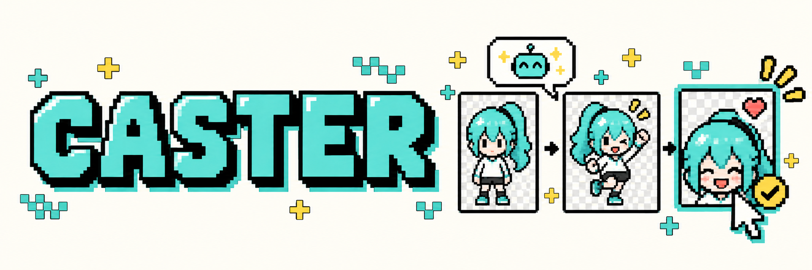
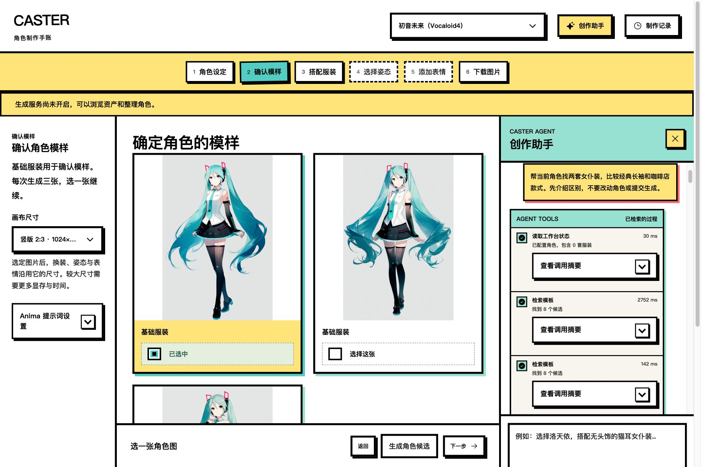
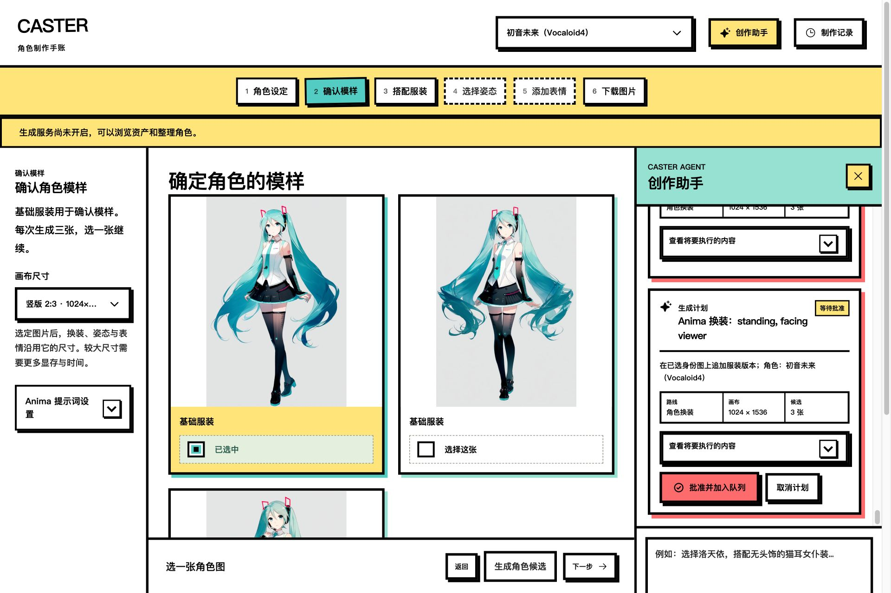
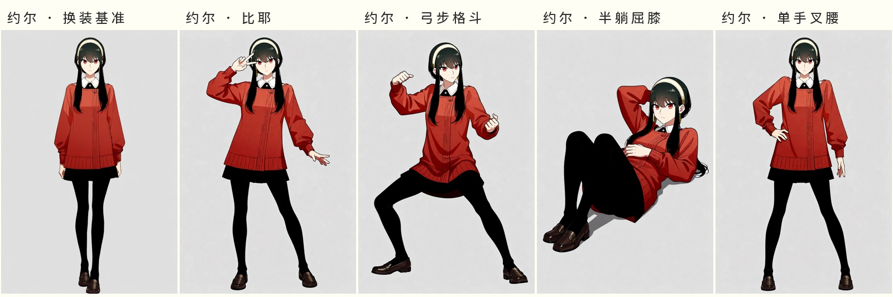
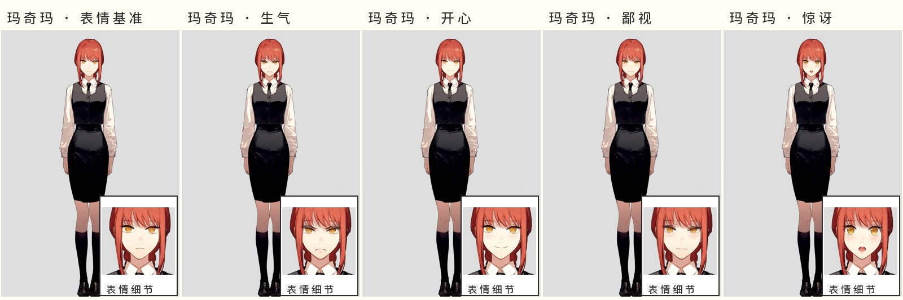
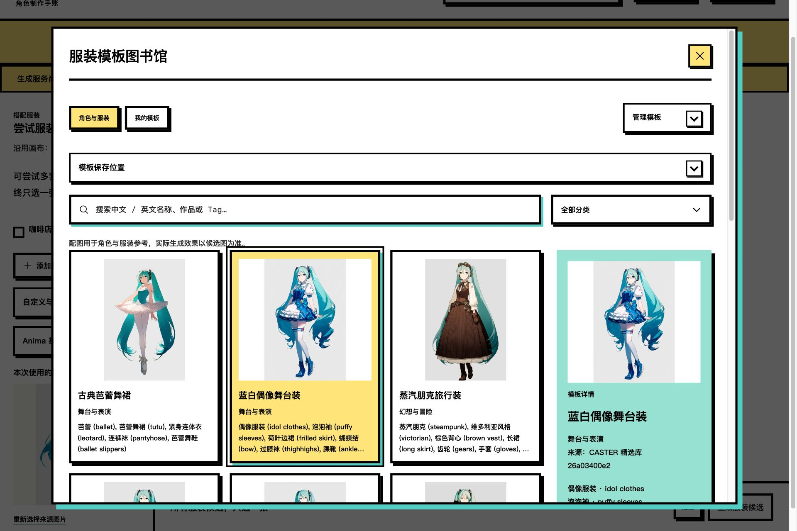

<p align="center">
  
</p>

<h1 align="center">CASTER</h1>
<p align="center"><strong>和 Agent 一起，把角色想法做成可复用的图像资产。</strong></p>
<p align="center">Character Asset Synthesis, Transformation &amp; Expression Rendering</p>
<p align="center">
  <a href="#开始创作">开始创作</a> ·
  <a href="#看看效果">效果展示</a> ·
  <a href="docs/README.md">文档</a> ·
  <a href="CONTRIBUTING.md">参与开发</a> ·
  <a href=".agents/skills/caster-character-production/SKILL.md">Agent Skill</a>
</p>

CASTER 是一个中文角色资产工作台：用自然语言找模板、比较方案，再把选定的角色做成不同姿态、表情和透明素材。Agent 负责检索和准备计划，你确认变更、批准生成，并从候选图中选出下一步的基准。

**React + TypeScript · FastAPI + SQLite · LlamaIndex · ComfyUI**

## 从一句描述开始

> “帮当前角色找两套女仆装，比较经典长袖和咖啡店款式。”

创作助手读取当前角色和工作台状态，调用检索工具，展示模板与依据。可以继续追问、调整要求，或让它准备一张待确认的工作台变更卡。



选好方案后，先确认角色或服装变更，再审阅生成计划。计划列出来源图片、画布和候选数量；点击 **“批准并加入队列”** 才会提交生成。



*以上为真实模型连接下的浏览器截图，展示检索、工作台变更与待批准计划；本次演示没有执行 GPU 生成，也未接入可选 RAG。采集时加载同一资产的原图，避免放大小缩略图；点击图片可查看高清文件。*

### 两种创作方式

| 模式 | 适合什么任务 | 如何继续 |
| --- | --- | --- |
| **分步制作** | 建立长期复用的角色资产 | 身份 → 服装 → 姿态 → 表情 → 导出，每一步选定基准 |
| **单张创作** | 围绕当前角色准备一张画面 | 描述场景和构图，审阅一次性生成计划 |

Agent 使用 LlamaIndex `FunctionAgent` 管理工具调用和结构化输出。它可以检索和准备计划，**没有批准或提交 GPU 任务的工具**。生成完成后也不会自动选用结果。

## 看看效果

### 动作：从一张基准图出发

约尔的四个动作分别沿用同一张换装基准：比耶、弓步格斗、半躺屈膝、单手叉腰。Pose Studio 提供三维姿态预设，Qwen Image Edit 执行动作编辑。



### 表情：独立分支，局部回贴

玛奇玛的生气、开心、鄙视和惊讶分别从同一张基准图制作。脸部放大窗便于比较细节；局部编辑使用掩码回贴，保留有效掩码外的像素。



*以上为生成的同人样例，展示动作与表情编辑，不含透明抠图。*

### 模板与候选，都在工作台里

角色模板支持中文名称、作品和双语标签搜索。服装库包含 50 套、9 类精选模板，配图统一使用 Miku，方便比较服装本身。也可以导入自己的模板 JSON。



| 能力 | 工作台中的操作 |
| --- | --- |
| 身份与服装候选 | 一次生成多张，比较后选用，旧版本继续保留 |
| 姿态与表情 | 选择姿态预设，从选定基准独立制作表情 |
| 画布与透明导出 | 常见比例、继承源图尺寸、原图下载与 RGBA PNG |
| 任务与恢复 | 查看批次进度、取消排队、失败重试，追溯来源图片和任务 |
| 标签知识 | 本地模板检索；可选 Qwen3 Embedding + Qdrant 语义检索 |

## 开始创作

### 选择运行方式

| 运行方式 | 需要准备 | 可以体验 |
| --- | --- | --- |
| 前端演示 | Node.js / npm | `?preview=1` 制作步骤与交互，不执行生成 |
| 手动工作台 | Python、uv、前端与后端；生成时接入 ComfyUI | 模板、角色、任务和资产管理，无需 LLM |
| Agent 工作台 | 在手动工作台上连接支持工具调用的模型 | 自然语言检索、工作台变更与生成计划；RAG 可选 |

推荐 Python **3.12**、Node.js **22** 和 uv。真实图像生成已在 Linux + RTX 4090 24GB 上验证，使用低显存模式、CPU VAE 与串行推理；其他硬件尚未验证。

### 启动前后端

在目标开发机器的项目根目录执行：

```bash
uv sync --locked --group dev
# 首次运行创建配置；已有配置保持不变
[ -f config.env ] || cp config.env.example config.env
bash scripts/run.sh
```

另开一个终端：

```bash
cd frontend
npm ci
npm run dev
```

打开 [工作台](http://127.0.0.1:4173/)；后端默认位于 `http://127.0.0.1:8189`，接口可在 [`/docs`](http://127.0.0.1:8189/docs) 查看。只体验前端时跳过后端步骤，打开 [演示模式](http://127.0.0.1:4173/?preview=1)。新克隆不附带历史生成资产，演示缺图时显示占位提示。

### 连接模型与生成环境

1. 在 **创作助手 → 模型连接** 中保存支持 function calling 的 OpenAI-compatible 服务。后端连接文件权限为 `0600`，重新打开同一工作台无需重填；可勾选浏览器记忆，在当前网址的浏览器存储中保留连接（包括密钥），也可清除该副本。
2. 按[依赖说明](docs/DEPENDENCIES.md)准备 ComfyUI、节点和模型，将 `config.env` 的 `AIGC_COMFY_URL` 指向服务。
3. 按[快速开始](docs/QUICKSTART.md)准备模板与 Pose Studio 资源，选择角色后开始制作。需要语义检索时，再配置 [RAG](docs/RAG.md)。

`config.env`、运行数据库、密钥、日志、模型权重和批量生成图片均排除在 Git 之外。远程服务建议回环监听，通过 SSH 隧道访问，参见[运行手册](docs/OPERATIONS.md)。

创建角色时可选上传头像或参考图。它仅保存在当前浏览器，用于角色展示，不作为生成输入或第二步候选；换浏览器、网址或清除网站数据后不会同步。第二步候选需要连接 ComfyUI 并明确生成，保存聊天模型连接不会开启图像生成。

## 生成链路

| 阶段 | 执行方式 | 工作流 |
| --- | --- | --- |
| 角色原图 | AnimaYume v15 文生图 | [sprite](workflows/sprite.api.json) |
| 角色换装 | AnimaYume 图生图 | [outfit](workflows/outfit.api.json) |
| 动作编辑 | Qwen Image Edit 2511 + Pose Studio LoRA | [pose](workflows/pose.api.json) |
| 表情编辑 | Qwen 脸部裁剪编辑 + SAM 掩码回贴 | [expression](workflows/expression.api.json) |
| 透明抠图 | BiRefNet，保持画布并输出 RGBA | [matte](workflows/matte.api.json) |
| 背景生成 | AnimaYume，独立 API 工作流 | [background](workflows/background.api.json) |

默认立绘为 1024×1536，其他尺寸见[画布预设](integrations/canvas-presets.json)。画师风格和固定正负面词由运行时设置管理；模型、节点版本与来源见[资源清单](integrations/README.md)。

## 开发与扩展

前端通过 `/api` 访问 FastAPI。后端保存角色、资产来源、授权快照和任务；Agent 准备计划，ComfyUI 执行已批准的生成。任务提交后记录 prompt ID，恢复时先核对执行结果。

```text
aigc/
├── agent/         # LlamaIndex、受限工具、会话与审批
├── routes/        # HTTP 路由
└── …              # 任务、资产、提示词、配置与 RAG
frontend/          # React 工作台与前端演示
workflows/         # ComfyUI API 图、可视图与参数绑定
custom_nodes/      # 局部编辑节点及可选控制节点
integrations/      # 资源来源、版本与画布预设
.agents/skills/    # 可供外部 Agent 使用的角色制作指南
scripts/           # 启动、导入、缓存和维护工具
tests/             # 后端回归测试
docs/              # 稳定文档与精选展示图片
.github/           # CI、Issue 与 PR 模板
```

在开发机器上运行：

```bash
make setup
make check
```

`make check` 包含静态与格式检查、后端测试、前端测试、类型检查和构建。GitHub CI 自动执行仓库检查；通过 CI 不代表真实模型或 GPU 图像质量已经验收。

- [系统架构](docs/ARCHITECTURE.md)：Agent、RAG、审批与恢复边界。
- [贡献指南](CONTRIBUTING.md)：开发流程、验证和仓库文件约定。
- [模板格式](docs/PROMPT_TEMPLATES.md)与[导入示例](examples/prompt-templates.json)：扩展角色和服装库。
- [角色制作 Skill](.agents/skills/caster-character-production/SKILL.md)：外部 Agent 复用现有 API。

## 来源与许可

生成环境基于 [ComfyUI](https://github.com/comfyanonymous/ComfyUI)；制作流程、Qwen 编码和 Pose Studio 参考 [VNCCS](https://github.com/AHEKOT/ComfyUI_VNCCS) 与 [VNCCS Utils](https://github.com/AHEKOT/ComfyUI_VNCCS_Utils)，透明输出使用 [BiRefNet](https://github.com/ZhengPeng7/BiRefNet)。完整模板、翻译、节点及代码来源见 [SOURCES.md](SOURCES.md)。

代码采用 [MIT](LICENSE)。第三方节点、模型与素材遵循各自许可；文档中的角色样例为功能展示，角色相关权利属于各自权利人。页首像素横幅为 AI 生成插画。
