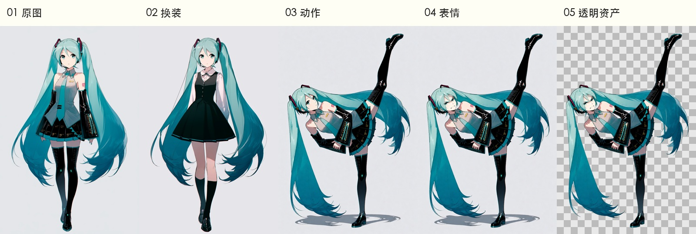

# CASTER

**Character Asset Synthesis, Transformation & Expression Rendering**

CASTER 是一个**角色立绘生成工具**，通过中文工作台选择角色与服装模板，生成原图、换装、调整动作与表情，最终导出透明 PNG。前端提供制作与审阅界面，后端管理模板、任务、版本和资产，ComfyUI 执行生成工作流。

## 运行要求

- **无GPU可用范围**：前端演示、模板/API管理和单元测试；真实生成需要独立ComfyUI GPU环境。
- **已验证硬件**：Linux上的RTX 4090 (24GB VRAM)，启用低显存与CPU VAE。更小显存（如RTX 3060 12GB）可能需要调整批量大小或模型精度。
- **软件**：Python 3.12、uv、Node.js 22/npm；完整模型环境见[依赖说明](docs/DEPENDENCIES.md)。
- **部署模式**：默认回环监听，适合本地开发或通过SSH隧道访问；当前无登录鉴权和账号隔离。

## 从角色设定到透明资产

**角色模板 → 身份原图 → 服装设计 → 动作编辑 → 表情编辑 → 透明导出**



| 步骤 | 在工作台中完成什么 |
| --- | --- |
| 角色设定 | 搜索角色模板，查看中英文标签，编辑角色特征与初始服装 |
| 身份原图 | 选择尺寸，生成候选图片，选定后续使用的角色基准 |
| 服装设计 | 从服装库选择方案或编辑提示词，对同一角色图生图换装 |
| 动作编辑 | 选择 Pose Studio 三维姿态预设，生成并选择动作图 |
| 表情编辑 | 从选定姿态生成开心、生气等表情，仅回贴脸部有效区域 |
| 透明导出 | 去除背景，预览透明边缘，下载原图、RGBA PNG 和资产清单 |

上图由当前配置的真实 Miku 实验结果组成，用于展示各阶段功能；换装和踢腿是同一身份原图的不同分支，最后三张是连续的“踢腿 → 生气 → 抠图”结果。角色样例为生成的同人展示，不代表官方素材。

[下载透明 Miku PNG](docs/images/miku-angry-transparent.png)

## 前后端功能

### 前端：角色制作工作台

React + TypeScript + Vite，提供中文分步界面和任务侧栏。

- **角色与服装库**：模板搜索、分类过滤、配图预览、中文名称与双语标签；支持自定义编辑、JSON 导入和导出。
- **候选图选择**：对比不同身份、服装和姿态候选，选定一张进入下一步；切换选择保留旧资产。
- **尺寸与预览**：选择常见画布比例，后续编辑继承原图尺寸；模板配图使用后端缓存、缩略图与懒加载。
- **任务与结果**：查看批次、进度、失败信息和生成结果；取消排队项，明确重试失败项。
- **导出与回看**：查看历史图片、透明结果和下载清单。

默认工作台使用真实后端；`?preview=1` 提供独立的本地演示。详见 [前端说明](frontend/README.md)。

### 后端：生成任务与资产管理

FastAPI + SQLite，使用内部 `aigc` 包连接 ComfyUI。

- **统一提示词编译**：将角色特征、服装模板、动作和风格组合成实际生成提示词；自动处理角色/作品名括号转义。
- **工作流适配**：把 API 请求绑定到 ComfyUI 工作流，上传参考图、提交任务并收集输出。
- **持久任务队列**：串行推理、幂等提交、断线后按 prompt ID 核对，避免重复生成。
- **版本与来源**：保存角色、服装版本、输入图、生成参数、候选选择和审阅记录。
- **局部编辑保护**：检测与分割脸部，按有效掩码回贴；无脸、多脸等情况进入待修正。
- **本地媒体服务**：管理模板配图缓存、生成资产、缩略图和下载。

前端通过 `/production/*`、`/prompt-templates/*`、`/jobs/*` 和 `/assets/*` 访问后端。部署方式见 [运行手册](docs/OPERATIONS.md)。

## ComfyUI 工作流

| 工作流 | 实现 | 主要配置 |
| --- | --- | --- |
| [角色原图](workflows/sprite.api.json) | AnimaYume v15 文生图 | Euler / Beta α=β=0.6，36 步、CFG 4、Shift 3 |
| [角色换装](workflows/outfit.api.json) | AnimaYume 原图 VAE 编码后重绘 | 同上，denoise 0.8 |
| [动作编辑](workflows/pose.api.json) | Qwen Image Edit 2511 + Pose Studio LoRA | Lightning 4 步、CFG 1、Euler / simple |
| [表情编辑](workflows/expression.api.json) | Qwen 脸部裁剪编辑 + SAM 掩码回贴 | 不加载姿态 LoRA，保留掩码外像素 |
| [透明抠图](workflows/matte.api.json) | BiRefNet | 保留画布，输出真实 RGBA |
| [背景生成](workflows/background.api.json) | AnimaYume 文生图 | 使用统一 Anima 采样配置，独立于角色制作流程 |

Anima 统一前置 `@rella`、`official_art` 和固定品质词。默认立绘 1024×1536，支持其他预设尺寸；后续换装、姿态和表情继承源图画布。

姿态流程以 **Pose Studio 人偶渲染图作为 image1、角色图作为 image2**，经 Qwen 多图参考编码与 Pose LoRA 生成，不是将两张图拼成一张后送入 ControlNet。

`workflows/` 同时保存 API 图和对应可视图；`bindings.json` 定义运行参数绑定。`workflows/experimental/` 保留独立实验，不代表全部已接入生产。

## 依赖与参考仓库

安装前先看[必需节点、模型、固定版本与安装顺序](docs/DEPENDENCIES.md)。下表说明项目关系，不表示所有仓库都需要安装。

| 项目 | 在 CASTER 中的用途 |
| --- | --- |
| [ComfyUI](https://github.com/comfyanonymous/ComfyUI) | 模型加载、节点执行与生成队列 |
| [ComfyUI_VNCCS](https://github.com/AHEKOT/ComfyUI_VNCCS) | 角色制作流程、Qwen 多图编码及表情处理参考 |
| [ComfyUI_VNCCS_Utils](https://github.com/AHEKOT/ComfyUI_VNCCS_Utils) | Pose Studio、三维人偶渲染与姿态/表情示例工作流 |
| [Comfyui-Anima-Tools-HUB](https://github.com/j955229/Comfyui-Anima-Tools-HUB) | 角色、服装提示词模板与配图来源 |
| [Danbooru 中英翻译表](https://github.com/ffdkj/ffdkj-Danbooru_Tag-Chinese-English-Translation-Table) | 角色、作品及标签的中文映射与双语检索 |
| [BiRefNet](https://github.com/ZhengPeng7/BiRefNet) | 前景分割与透明资产输出 |
| [st-chatu8](https://github.com/damoshen123/st-chatu8) | 参数化 ComfyUI 工作流调用的结构参考，未集成其完整插件 |

固定版本与来源清单见 [integrations/](integrations/README.md)。模型、上游模板与第三方节点分别遵循各自许可，不随本仓库打包分发。

## 快速开始

从[快速开始指南](docs/QUICKSTART.md)启动无GPU API和前端演示，检查 `/health`、浏览API文档，再配置真实生成环境。

```bash
uv sync --locked --group dev
uv run --locked pytest -q
AIGC_DATA_DIR="$PWD/data/local-dev" uv run --locked uvicorn aigc.api:app --host 127.0.0.1 --port 8189 --workers 1
```

另一个终端：

```bash
cd frontend
npm ci
npm run dev -- --port 4173 --strictPort
```

打开 <http://127.0.0.1:4173/?preview=1> 体验演示；打开 <http://127.0.0.1:8189/docs> 查看API。

成功启动后：
- 后端显示 `Application startup complete.`
- 访问 `/health` 应返回 `{"status":"ok"}`
- 前端显示 `Local: http://127.0.0.1:4173/`

**注意**：干净克隆缺少历史演示图，模板预览会显示占位符。API没有模拟生成模式；未接通ComfyUI时不要提交真实推理。

## 项目结构

### 核心模块

- `aigc/`：后端核心包。
  - `api.py`：API入口；`production.py`：工作台生产接口。
  - `worker.py`：生成执行、恢复与结果收集；`store.py`：持久记录与任务状态。
  - `workflows.py`：ComfyUI图与参数绑定；`templates.py`：模板导入和角色实例化。
  - `prompts.py`、`anima_defaults.py`：提示词编译、转义与风格默认。
  - `canvas.py`：画布预设与源图尺寸；`workbench.py`：制作流程和请求模型。
- `frontend/`：React工作台。
  - `src/LiveWorkbench.tsx`：真实制作界面；`src/production.ts`：生产API客户端。
  - `src/library.ts`：模板客户端；`src/model.ts`：独立演示状态模型。
- `workflows/`：`*.api.json`供后端调用，`*.workflow.json`供ComfyUI导入，`bindings.json`保存参数绑定。
- `custom_nodes/AIGC_LocalEdit/`：完整生产链路需要的裁剪、回贴和画布节点。
- `custom_nodes/CASTER_AnimaControl/`：可选姿态控制实验，未接生产。

### 配置、数据与工具

- `integrations/`：上游来源、固定版本和预设定义，见[目录说明](integrations/README.md)。
- 根目录 `*-manifest.json`：模型、节点下载清单。
- `data/`：运行时数据库、模板、翻译、缓存（不入Git）。
- `scripts/`：部署、导入、缓存与验证工具，见[脚本索引](scripts/README.md)。
- `tests/`：后端单元测试。

### 文档

- `docs/QUICKSTART.md`、`docs/DEPENDENCIES.md`：启动和依赖安装。
- `docs/OPERATIONS.md`：部署运维。
- [文档导航](docs/README.md)：部署、依赖与模板说明。
- `docs/images/`：功能展示图片。
- [角色制作 Skill](.agents/skills/caster-character-production/SKILL.md)：Agent 使用现有 API 制作角色资产的操作指南。

## 已知限制

- 人物细节、遮挡、发丝和透明边缘需人工审阅
- 固定风格提示不保证所有结果完全一致
- LLM 接入暂未启用

## 许可证

本项目采用 MIT 许可证。第三方组件和模型权重遵循各自许可证，详见 [LICENSE](LICENSE)。
